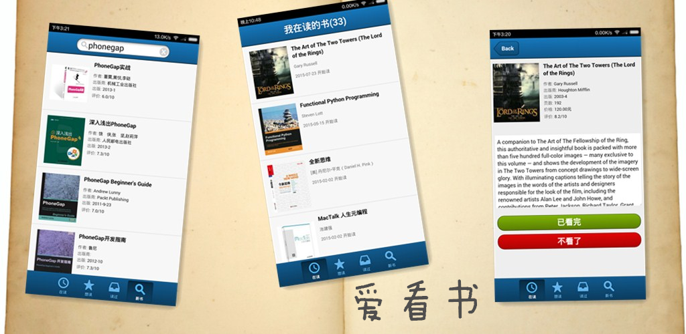

# 爱看书
一个读书记录APP，用来记录自己正在读/想读/读过的书。

## 功能
* 用豆瓣账号登录
* 显示"在读"/"想读"/"读过"清单，点击清单里的书，显示书详细信息
* 可以修改书的状态（在读，想读，读过）来记录自己的读书情况
* 通过书名/作者/ISBN搜书，并加入“想读”清单
* 支持用手机扫描图书条码/二维码来搜书

## Android和iOS版APP已经发布，敬请下载试用
* Android
	* [Google Play](https://play.google.com/store/apps/details?id=com.easy.wodu "Google Play")
	* [豌豆荚](http://www.wandoujia.com/apps/com.easy.wodu "豌豆荚")
	* [安卓市场](http://apk.hiapk.com/appinfo/com.easy.wodu/78 "安卓市场")
	* [小米应用商店](http://app.mi.com/detail/110061?ref=search "小米应用商店")
* iOS
	* [AppStore](https://itunes.apple.com/us/developer/zhu-zhong/id1035152444 "AppStore")

## 用到的技术
* Sencha Touch
* Cordova
* 基于豆瓣API

## Todo list
* more ...
